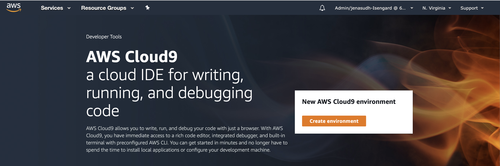
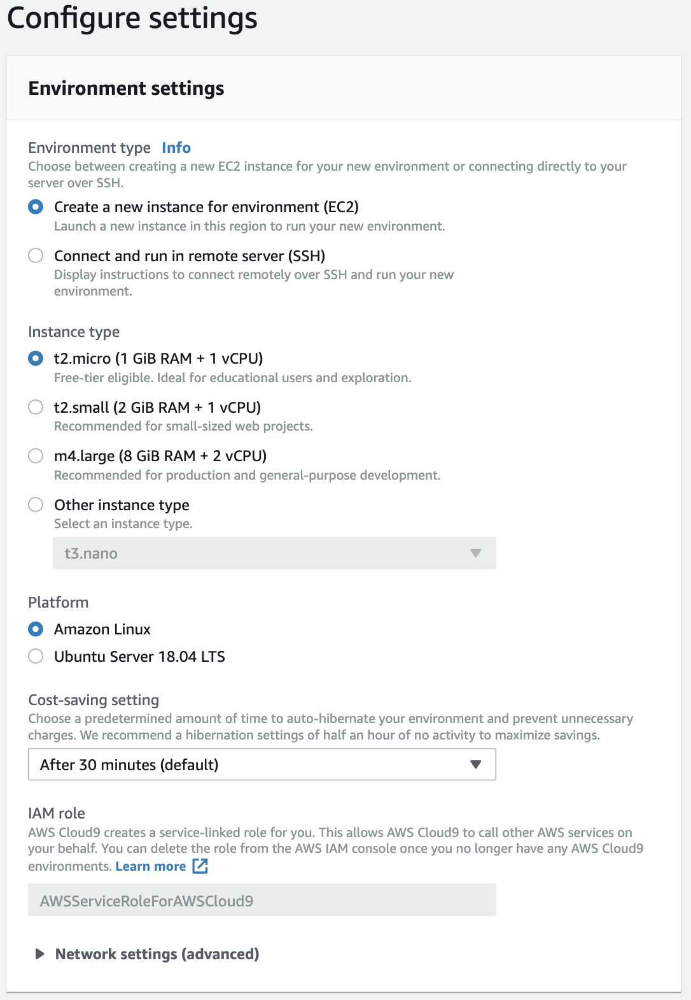
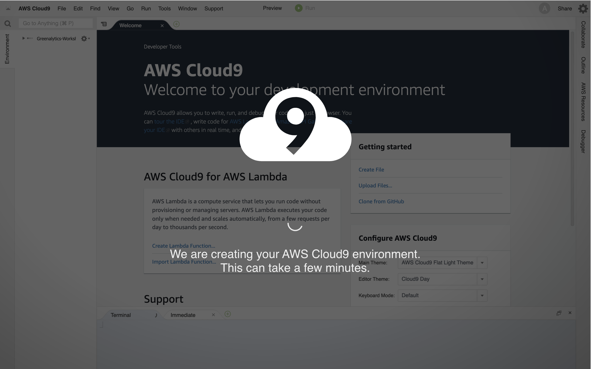
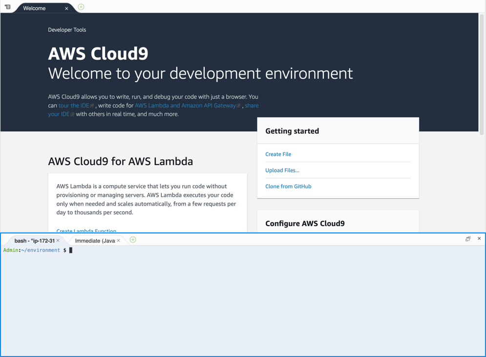

# Workshop Guide

## Prerequisites

- AWS Account
- A laptop with internet access
- Use `us-east-1` AWS Region only.

## Exercise 1: Setting up your environment for the workshop

We will create an online development environment using [AWS Cloud 9](https://console.aws.amazon.com/cloud9/home). Within this Cloud9 environment, we will install and use AWS CDK to bootstrap a simulated IoT device belonging to an AWS IoT Greengrass group.

### Steps

1. From the AWS Console, navigate to [Cloud 9](https://console.aws.amazon.com/cloud9/home)
   
2. Click **Create environment**.
3. Enter a name for your Cloud9 environment and (optionally) any description you would want to associate with this Cloud9 environment. Click **Next step** when you are done.
   
4. In the next step, accept the default environment settings and click **Next Step**
   
5. Click **Create environment** to create your Cloud9 environment.
6. Allow few minutes for your Cloud9 environment to be created. Once created, you will be automatically redirected to your created environment.
   
7. Once you are in your Cloud9 environment, you should be able to see a terminal window at the bottom of your screen
   

8. Upload your private key named "ee-default-keypair.pem" into Cloud9 environment using File > Upload Local Files... option from Cloud9 commands. Uploading your key ensures that Greengrass Core Ec2 Instance and Node-Red EC2 instance can be accessed through SSH from your Cloud9 environment. Change permissions of your private key after upload.

```
chmod 400 ee-default-keypair.pem
```

9. Enter the following command to install AWS CDK in your Cloud9 environment so that we can bootstrap our IoT environment.

```
npm install -g aws-cdk@1.17.1
```

10. Run the following command to see the version number of the AWS CDK.

```
cdk --version
```

11. Clone the code repository for the workshop

```
git clone https://github.com/aws-samples/aws-iot-greengrass-edge-analytics-workshop.git
```

12. Switch into the cloned repository

```
cd aws-iot-greengrass-edge-analytics-workshop
```

13. Install the required npm dependencies as defined in package.json

```
npm install
```

14. Bootstrap your AWS CDK Toolkit

```
cdk bootstrap
```

15. Deploy your stack with AWS CDK

```
cdk deploy
```

Note: This will require few minutes to complete. Contact a workshop assistant if your CDK deployment fails.

16. Once, the stack is deployed, you should see 6 outputs

- `EdgeAnalyticsStack.Region` provides the AWS Region where your stack is being deployed. You will need this output value for **Step 21**.
- `EdgeAnalyticsStack.GreengrassGroupId` provides the unique id corresponding to your Greengrass Group. You will need this output value for **Step 21**.
- `EdgeAnalyticsStack.GreengrassCoreEC2IPAddress` provides the Public IP Address to reach your Greengrass Core. You may need this value to SSH to your Greengrass Core.
- `EdgeAnalyticsStack.NetdataURL` provides the URL to access a helpful system monitoring tool called Netdata. You may need this value to troubleshoot performance of your Greengrass Core Instance
- `EdgeAnalyticsStack.NodeRedURL` provides the URL for accessing a simulated device build on the Node-RED framwork. You will need this URL from **Step 22** onwards. The IP Address in this URL will be used to SSH into the Node Red Instance in **Step 20**.
- `EdgeAnalyticsStack.NodeRedDashboardURL` provides the URL for accessing a telemetry dashboard on the Node-RED framwork. You will need this URL from **Step 22** onwards.

```
...
EdgeAnalyticsStack.Region = {AWS Region}
EdgeAnalyticsStack.GreengrassGroupId = {Greengrass Group Id}
EdgeAnalyticsStack.GreengrassCoreEC2IPAddress = {Greengrass Core IP-Address}
EdgeAnalyticsStack.NetdataURL = http://{Greengrass Core IP-Address}/netdata/
EdgeAnalyticsStack.NodeRedURL = http://{IoT Device IP-Address}/node-red
EdgeAnalyticsStack.NodeRedDashboardURL: http://{IoT Device IP-Address}/node-red/ui
```

17. Navigate to AWS IoT Core Service within your AWS Console

    > For **us-east-1** region click https://console.aws.amazon.com/iot/home?region=us-east-1#/greengrass/grouphub

18. Click on your Greengrass Group tile to view additional actions
19. Click on Actions dropdown menu and select Deploy. This action deploys your Greengrass Group and its associated configurations to your Greengrass Core Instance. If prompted for Greengrass Core Discovery options, select Auto Discovery option.
20. Verify the Greengrass Group Deployment is successufully completed.
21. Open a new terminal by selecting Window > New Terminal from Cloud9 commands. SSH to your Node Red Instance by typing the command below in your new terminal.

```
ssh -i ee-default-keypair.pem ubuntu@{IoT Device IP-Address}
```

Note: IP Address from `EdgeAnalyticsStack.NodeRedURL` output of `cdk deploy`

22. Once logged in, run the following commands. The inputs required for the commands are `Greengrass Group Id` and `AWS Region` which were provided as ouputs in **Step 16**. Please substitute {Greengrass Group Id} and {AWS Region} with values from Step 16.

```
CERTIFICATE_AUTHORITY_ID=$(aws greengrass list-group-certificate-authorities --group-id {Greengrass Group Id} --region {AWS Region} | jq -r '.GroupCertificateAuthorities[0].GroupCertificateAuthorityId')

aws greengrass get-group-certificate-authority --certificate-authority-id $CERTIFICATE_AUTHORITY_ID  --group-id {Greengrass Group Id} --region   {AWS Region} | jq -r '.PemEncodedCertificate' > /home/ubuntu/.awscerts/group-CA.crt

```

This manual action is required because Greengrass Group Certificate can only be retrieved after the Greengrass Group is deployed (See **Step 20**). Restart Node Red for the new certificate to be included by Node Red.

```
pm2 restart node-red
```

23. Navigate to the Node-Red URL. This Node-Red setup simulates an AWS IoT Thing sending MQTT messages containing metrics like temperature (in fahrenheit), pressure (in psi) and humidity (in percent). Click on **Debug messages** button
    

24. To switch on the simulated AWS IoT Thing, click the ON Switch Node in Node-Red. You should see temperature, pressure and humidity readings being transmitted to AWS Greengrass Core in the **debug** pane.
25. Navigate to the Node-Red Dashboard URL received in CDK deployment output in **Step 16**. You should now be able to see a live chart with temperature, pressure and humidity plotted over a time range. You might notice that during some instants in time, there might be missing metrics in temperature, pressure or humidity. Also you might notice that the time-axis does not have contiguous timestamp values. This behavior refects IoT devices which transmit metrics only on change.
26. To switch off the simulated AWS IoT Thing, click the OFF Switch Node in Node-Red. The transmission of temperature, pressure and humidity readings should now appear stopped in the **debug** pane.

## Exercise 2: Filling up missing metrics

In this exercise, we will fill up missing metrics as they are transmitted through AWS IoT Greengrass.

### Steps:

26. In your Cloud9 environment, open the file **analyzer-lambda.py**. Populate the placeholder lines `Code exercise for filling missing metrics...` with the code below:

```
timeline_df = get_source_dataframe(end_time, '1S')
raw_df = pd.concat([timeline_df, raw_df], axis=1)
raw_df.fillna(method='ffill', inplace=True)
raw_df = raw_df.fillna(method='backfill')
raw_df = raw_df.resample('{0}S'.format(min_resolution_seconds), loffset=calculated_offset).mean()
```

27. Save the file **analyzer-lambda.py**. Deploy the changes to your Analyzer Lambda into greengrass with AWS CDK

```
cdk deploy
```

28. Navigate to your greengrass group in AWS IoT Core and deploy the changes to your Greengrass Core Instance.

29. Now switch ON your simulated IoT Thing in Node-Red and navigate to your Dashboard URL. You should be able to see that none of the metrics - temperature, pressure or humidity are missing in the live chart and the timestamps in time-axis are now contiguous. This demonstrates IoT metrics that are **"filled in time-series"**

30. To switch off the simulated AWS IoT Thing, click the OFF Switch Node in Node-RED. The transmission of temperature, pressure and humidity readings should now appear stopped in the **debug** pane.

## Exercise 3: Performing statistical calculations on time-series data

In this exercise, we will perfom rolling statitistical calculations like `Mean` and `Standard Deviation` on the filled time-series data produced by **analyzer-lambda.py**.

### Steps:

31. In your Cloud9 environment, open the file **analyzer-lambda.py**. Populate the placeholder lines for `Code exercise for rolling statistical calculation...` with the code below:

```
mean_df = raw_df.rolling(min_resolution_seconds, min_periods=1).mean()
std_df = raw_df.rolling(min_resolution_seconds, min_periods=1).std()
mean_df.columns = [str(col) + '_mean' for col in mean_df.columns]
std_df.columns = [str(col) + '_std' for col in std_df.columns]
raw_df = pd.concat([raw_df, mean_df, std_df], axis=1)
```

32. Save the file **analyzer-lambda.py**. Deploy the changes to your Analyzer Lambda into greengrass with AWS CDK

```
cdk deploy
```

33. Navigate to your greengrass group in AWS IoT Core and deploy the changes to your Greengrass Core Instance.

34. Now switch ON your simulated IoT Thing in Node-Red and navigate to your Dashboard URL. You should be able to see a rolling mean and standard deviation plot of metrics - mean_temperature, mean_pressure, mean_humidity, std_temperature, std_pressure and std_humidity along with raw values of the filled time-series metrics - temperature, pressure and humidity. This demonstrates statistical calculations on IoT metrics that are **"filled in time-series"**.

## Exercise 4: Clean-up environment

35. In order to clean up the resources created in this workshop, navigate to your greengrass group in AWS IoT Core and **Reset Deployment** of your Greengrass Group.

36. Delete all the resources created with AWS CDK, run the following command in your Cloud9 environment

```
cdk destroy
```

37. To delete your Cloud9 environment, go to your [Cloud9 dashboard](https://console.aws.amazon.com/cloud9/home) and delete the Cloud9 environment created in Steps 1 - 5.
